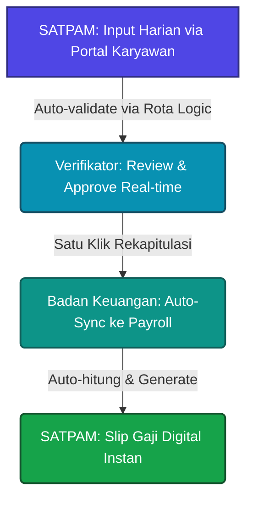

# Alur Pelaporan Shift Satpam Digital (Sistem Baru)

Alur pelaporan shift Satpam yang baru diimplementasikan secara digital untuk memotong seluruh birokrasi manual yang lambat, tidak efisien, dan rawan kesalahan manusia (*human error*). Dengan sistem ini, seluruh proses mulai dari pencatatan harian, validasi, rekapitulasi, hingga perhitungan gaji berjalan secara otomatis dan terintegrasi langsung ke dalam sistem database payroll.

Berikut adalah visualisasi perbandingan proses baru yang memotong rantai birokrasi:

---

## 1. Pencatatan Shift Mandiri via Portal Karyawan (Self-Reporting)
* **Sebelumnya (Manual):** Ketua Shift mencatat kehadiran dan detail shift anggota secara manual pada lembar kertas harian setelah mendatangi setiap pos secara fisik.
* **Sekarang (Digital):** 
  * Setiap anggota Satpam atau Ketua Shift menginput laporan aktivitas harian secara mandiri melalui **Portal Karyawan** ([activities/page.tsx](file:///Users/ghinannavsih/Documents/Internal-BAK/src/app/employee/activities/page.tsx)).
  * Sistem secara otomatis memverifikasi jenis shift (*Harian*, *Jumat & Libur*, *Lembur Sendiri*, atau *Lembur Cover*) menggunakan logika rota otomatis ([satpamRotation.ts](file:///Users/ghinannavsih/Documents/Internal-BAK/src/utils/satpamRotation.ts)).
  * Logika rota ini mengetahui persis jadwal masing-masing kelompok roster (Bastomi, Mujiono, Suhariono) dan menentukan status shift/lembur secara otomatis berdasarkan aturan rotasi mingguan tanpa perlu pengecekan manual.

## 2. Validasi Real-Time & Persetujuan Digital
* **Sebelumnya (Manual):** Di akhir bulan, sekretariat harus mengumpulkan dan memeriksa secara manual sekitar 90 lembar laporan fisik bulanan untuk diserahkan ke Kepala Biro Umum agar ditandatangani basah.
* **Sekarang (Digital):**
  * Dokumen fisik dan tanda tangan basah dieliminasi sepenuhnya.
  * Setiap laporan yang masuk dapat ditinjau dan disetujui secara real-time oleh penanggung jawab (Majlis Kamtib / Kepala Biro Umum) melalui dashboard **Review Aktivitas** ([activity-review/page.tsx](file:///Users/ghinannavsih/Documents/Internal-BAK/src/app/dashboard/payroll/activity-review/page.tsx)).
  * Persetujuan dilakukan secara digital dalam hitungan detik, mencegah penumpukan berkas verifikasi di akhir bulan.

## 3. Rekapitulasi Otomatis (Instant Aggregation)
* **Sebelumnya (Manual):** Sekretaris menghabiskan waktu berhari-hari memeriksa lembaran kertas satu per satu dan menyalin datanya ke dalam satu dokumen rekapitulasi tertulis.
* **Sekarang (Digital):**
  * Halaman **Rekap Pekarya** ([rekap-pekarya/page.tsx](file:///Users/ghinannavsih/Documents/Internal-BAK/src/app/dashboard/payroll/uraian/rekap-pekarya/page.tsx)) secara otomatis menarik seluruh data `ActivityReports` kategori `SATPAM` yang telah disetujui untuk periode tersebut.
  * Data diakumulasikan secara instan ke dalam kolom-kolom shift (*harian*, *jumatLibur*, *lemburSendiri*, *lemburCover*) hanya dengan satu klik.
  * Sistem juga menyediakan opsi transisi OCR (Optical Character Recognition) via [parse_rekap.py](file:///Users/ghinannavsih/Documents/Internal-BAK/scripts/parse_rekap.py) jika ada data rekapitulasi cetak / legacy spreadsheet yang perlu diproses secara otomatis.

## 4. Sinkronisasi Langsung ke Master Payroll (Zero Manual Entry)
* **Sebelumnya (Manual):** Petugas Badan Keuangan harus mengetik ulang seluruh informasi jam kerja dan variabel shift dari lembar rekapitulasi cetak ke dalam database master payroll.
* **Sekarang (Digital):**
  * Proses pengetikan ulang dihilangkan sepenuhnya.
  * Data shift yang sudah terverifikasi di halaman rekapitulasi langsung tersinkronisasi ke sistem perhitungan payroll.
  * Setiap jenis shift dikalikan secara otomatis dengan tarif yang berlaku (Rp12.500 untuk Harian, Rp25.000 untuk Jumat/Libur, Rp30.000 untuk Lembur Sendiri, dan Rp50.000 untuk Lembur Cover) sesuai aturan dalam [SATPAM_LOGIC.md](file:///Users/ghinannavsih/Documents/Internal-BAK/SATPAM_LOGIC.md) untuk menerbitkan rincian gaji akhir secara instan.

## 5. Penerbitan & Akses Slip Gaji Digital Mandiri
* **Sebelumnya (Manual):** Sistem master payroll memproses kalkulasi akhir, mencetak slip gaji fisik, dan mendistribusikannya secara manual kepada setiap anggota Satpam.
* **Sekarang (Digital):**
  * Setelah kalkulasi payroll selesai diproses di dashboard keuangan, slip gaji digital diterbitkan secara instan.
  * Anggota Satpam dapat langsung melihat rincian gaji, tunjangan, dan lembur secara transparan melalui menu **Payslip** ([payslip/page.tsx](file:///Users/ghinannavsih/Documents/Internal-BAK/src/app/employee/payslip/page.tsx)) di akun masing-masing.
  * Mengurangi biaya cetak kertas, mempercepat distribusi, dan menjamin kerahasiaan data slip gaji karyawan.

---

### Perbandingan Efisiensi Proses

| Parameter | Proses Manual (Lama) | Proses Digital (Baru) |
| :--- | :--- | :--- |
| **Media Pencatatan** | Kertas Fisik (90+ lembar/bulan) | Database Cloud (Firestore) |
| **Pengecekan Shift & Lembur** | Manual oleh Ketua Shift & Sekretariat | Auto-verifikasi Rota Roster ([satpamRotation.ts](file:///Users/ghinannavsih/Documents/Internal-BAK/src/utils/satpamRotation.ts)) |
| **Waktu Rekapitulasi** | 2-3 Hari Kerja | Instan (Sekali Klik) |
| **Metode Otorisasi** | Tanda Tangan Basah Fisik | Persetujuan Digital Real-time |
| **Input Data Payroll** | Manual Re-typing oleh Keuangan | Otomatis Sinkronisasi Database |
| **Penyerahan Slip Gaji** | Cetak & Distribusi Fisik | Akses Mandiri via Web Portal |
| **Potensi Human Error** | Sangat Tinggi (salah hitung/ketik) | Sangat Rendah (kalkulasi sistem teruji) |
