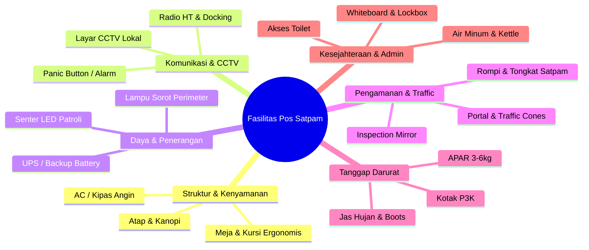

# Brainstorming: Outpost & Security Guard Post Facilities (Fasilitas Pos Satpam)

Dokumen ini berisi pemikiran dan analisis kebutuhan fasilitas dasar, teknis, keselamatan, dan operasional untuk pos penjagaan (**Pos Satpam 1–9**) di lingkungan kampus/instansi.

---

## 1. Perlindungan & Struktur Bangunan (Structural & Comfort Essentials)

* **Bangunan Fisik & Cuaca:**
  * Atap & kanopi pelindung (melindungi dari hujan lebat & panas terik).
  * Jendela pemantauan sudut pandang luas (360°/multi-arah) dengan kaca film anti-silau.
  * Pintu pos dengan kunci pengaman ganda (*deadbolt/smart lock*).
  * Sistem pengondisi udara: Kipas angin plafon/dinding atau AC split kecil (sangat penting untuk *Shift Sore* & *Malam*).
* **Fasilitas Istirahat Sederhana (Shift Malam):**
  * Meja kerja & kursi ergonomis tahan lama (kulit sintetis/plastik *heavy duty*).
  * Kursi/tempat duduk cadangan untuk anggota yang sedang berkoordinasi.
  * Tempat penyimpanan tas & jaket (*locker* kecil/gantungan baju).

---

## 2. Komunikasi & Sistem Pengawasan (Communication & Surveillance)

* **Komunikasi Instan:**
  * Docking pengisi daya Handy Talkie (HT) & baterai cadangan.
  * Telepon kabel internal (Intercom) yang terhubung langsung ke **Majlis Kamtib / Pos Induk / Biro Umum**.
  * Handphone operasional pos / tablet digital untuk input lapor kegiatan harian.
* **Perangkat Pengawasan:**
  * Layar monitor CCTV lokal (menampilkan *live feed* area sekitar pos & gerbang masuk).
  * Tombol Darurat (*Panic Button / Silent Alarm*) yang terhubung langsung ke Pusat Keamanan Utama.
  * Megafon / Pengeras suara portable untuk pengarahan massa/lalu lintas saat acara besar.

---

## 3. Infrastruktur Daya & Penerangan (Power & Lighting)

* **Kelistrikan & Cadangan Daya:**
  * Uninterruptible Power Supply (UPS) / Baterai cadangan untuk menjaga CCTV & HT tetap menyala saat mati listrik.
  * Stopkontak berpelindung (*surge protector*) yang cukup untuk *charge* HT, HP, tablet, dan senter.
* **Penerangan Malam Hari:**
  * Lampu sorot LED perimeter (*Floodlight*) yang mengarah ke area gerbang & jalan raya.
  * Senter LED daya tinggi (*Tactical Searchlight*) dengan kabel *charger* untuk patroli mobil/ketua shift.
  * Lampu darurat (*Emergency Light*) otomatis menyala saat listrik padam.

---

## 4. Peralatan Pengatur Lalu Lintas & Keamanan (Traffic & Security Gear)

* **Pengaturan Akses & Keluar-Masuk:**
  * Portal gerbang (*Boom Barrier*) manual atau otomatis.
  * Kerucut lalu lintas (*Traffic Cones*) reflektif & papan petunjuk jalan (*Signage*: "Wajib Lapor", "Batas Kecepatan 20 km/jam").
  * Tongkat pengatur lalu lintas menyala (*Traffic Baton LED*).
* **Pemeriksaan & Pengamanan:**
  * Cermin periksa bawah kendaraan (*Under Vehicle Inspection Mirror*).
  * Alat pemindai logam genggam (*Handheld Metal Detector*).
  * Perlengkapan diri petugas: Tongkat T (*T-Baton/Tombak*), peluit, dan rompi reflektif malam (*Safety Vest*).

---

## 5. Keselamatan & Tanggap Darurat (Safety & Emergency Response)

* **Peralatan Darurat:**
  * Alat Pemadam Api Ringan (APAR) tipe *Dry Chemical Powder / CO2* (3kg - 6kg).
  * Kotak P3K standar (*First Aid Kit* lengkap dengan perban, pembersih luka, dan obat dasar).
  * Jas hujan karet tebal & sepatu boot karet (*Safety Raincoat & Boots*) untuk patroli di musim hujan.
* **Informasi Darurat:**
  * Papan Informasi Kontak Darurat (Nomor Polsek, Rumah Sakit terdekat, Pemadam Kebakaran, Pimpinan Kamtib).

---

## 6. Logistik & Sanitasi Petugas (Sanitation & Logistics)

* **Kesejahteraan Petugas:**
  * Dispenser air minum / galon air.
  * Teko pemanas air listrik (*Electric Kettle*) untuk kopi/teh saat jaga *Shift Malam*.
  * Tempat sampah terpilah (Organik & Non-Organik) dengan tutup.
* **Fasilitas Sanitasi:**
  * Akses mudah ke Toilet / MCK terdekat (atau toilet en-suite khusus pos utama).

---

## 7. Administrasi & Serah Terima Shift (Administrative & Shift Handover)

* **Serah Terima (Handover):**
  * Papan tulis putih (*Whiteboard*) untuk pengumuman instruksi pimpinan, jadwal rotasi, & catatan khusus shift.
  * Buku Mutasi / Logbook fisik cadangan (jika sistem digital sedang *offline*).
  * Kotak kunci terenkripsi (*Lockbox / Key Cabinet*) untuk menyimpan kunci-kunci gedung & fasilitas sekitar pos.

---

## Ringkasan Kategori Fasilitas Pos

