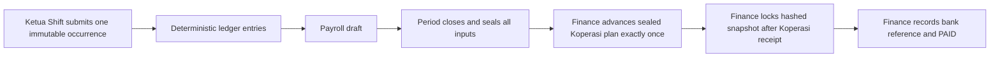
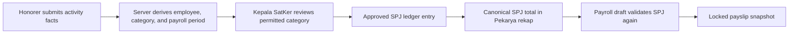

# Payroll Security Rollout

This change set is forward-only. It does not migrate, rewrite, delete, or
automatically “repair” any historical shift, payslip, user, or payment record.
Legacy anomalies are reported for human review only.

## Enforced financial workflow



- Satpam shifts use the shift start date as the duty, Friday/holiday, and
  payroll-period date. A Thursday 22:00–Friday 08:00 shift is Thursday/Harian.
- A shift occurrence, activity report, ledger entry, guard duty index, payment,
  and request idempotency key have deterministic or unique identities.
- Submitted shifts and final payslips have no client write path.
- Attendance periods cannot be reopened after closure.
- Verification and locking are one atomic action and require a closed period.
- Only `finance_verifier` and `super_admin` may perform that action.
- Saving a draft previews Koperasi loans server-to-server. The sealed plan must
  exactly equal the `Pinjaman Kop. UNIPDU` deduction before the period closes.
- Koperasi progression is idempotent per payroll period and loan. A failed
  Koperasi request leaves the payslip as a retryable draft; a final installment
  is automatically marked `Lunas`.
- Locked snapshots are hashed. Rate/config changes cannot recalculate them.
- A payment document is unique per employee and period, and `PAID` requires a
  bank reference.
- Corrections create a new request. They do not unlock or overwrite history.

## Pekarya SPJ workflow



- `ActivityReports` and `KegiatanSpj` are read-only from the browser. All
  submissions and reviews use authenticated server routes.
- Duplicate activity identity and duplicate request IDs are rejected
  transactionally. Spotty-network retries reuse the same request ID.
- The employee ID, active status, and job category come from
  `Employees_BlueCollar`; the browser cannot nominate another employee or
  category.
- Kepala SatKer can review only categories listed in `permittedCategories`.
  Reports can move from `pending` to exactly one of `approved` or `declined`.
- An approved report cannot be edited. A declined report may be revised and
  resubmitted, with before/after data retained in `FinancialAuditLogs`.
- SOPIR wages use reviewed `upahBersih` exactly once. Operational costs,
  reimbursements, fuel, toll, and unspent cash are not duplicated into the
  employee SPJ earning.
- SPJ events are category-scoped, validate every recipient against the active
  employee master, and use optimistic revisions to reject simultaneous edits.
- The SPJ column in Rekap Pekarya is derived and read-only. Payroll draft
  creation independently recomputes approved activities and events and rejects
  a mismatched SPJ amount before it can reach a payslip.

## Required deployment order

1. Back up Firestore and export the currently deployed rules.
2. Generate one random HMAC value of at least 32 characters. Store it as the
   Koperasi Functions secret `INTERNAL_PAYROLL_HMAC_SECRET` and as the
   Internal-BAK App Hosting secret `koperasi-payroll-hmac-secret`. Never expose
   it to either browser application.
3. Upgrade/install Koperasi Functions under Node 20, then deploy
   `payrollLoanBridge` and `recordManualLoanInstallment` before deploying the
   Koperasi period-aware Simpan Pinjam UI.
4. Deploy Internal-BAK and `Current_Firestore_Rules.md`/`storage.rules`
   together during a maintenance window. Confirm
   `KOPERASI_PAYROLL_BRIDGE_URL` points to the deployed bridge function.
5. Create the App Hosting secret `google-maps-api-key` with a server-only,
   API-restricted Directions key. Keep the browser key separately restricted by
   HTTP referrer.
6. Assign the `finance_verifier` role to the authorized Badan Keuangan staff.
   Keep at least two `super_admin` accounts for recovery.
7. While July 2026 remains open, run a read-only Koperasi preview and resave
   every affected draft. Resolve every deduction mismatch or ambiguous borrower
   before closure; do not manually record July installments in parallel.
8. In Payroll, configure the national-holiday calendar for the year.
9. Open the current attendance period. Once all shifts are entered, close it.
   Closure is permanent.
10. Test one non-production employee through draft → close period → verify and
    lock → Koperasi receipt → payment created → paid before processing the full
    institution.
11. Monitor `FinancialAuditLogs`, `PayrollKoperasiProgressions`, Koperasi
    `payrollInstallmentProgressions`, and API errors.

The Admin SDK credential must be supplied through the hosting environment.
`service-account.json` and `.env*` are ignored and must never be committed.
Rotate any credential that may previously have been exposed.

## Historical review (read-only)

Run:

```bash
npm run audit:satpam-payroll -- --period 2026-07
npm run audit:pekarya-spj -- --period 2026-07
```

The command only performs Firestore reads and prints JSON to stdout. It has no
write, update, or delete operation. A `critical` finding must be reconciled by
Finance outside the automated flow and approved under an explicit correction
procedure; do not edit old documents in place.

## Operational policy

- Calendar updates and team changes require reasons and immutable audit logs.
- A Satpam team is exactly one Ketua plus nine active members. No guard may be
  in two teams.
- `Lembur Cover` requires the absent roster guard and a reason.
- `Lembur Sendiri` is only the single off-duty roster member selected as an
  extra assignment.
- Spotty-network retries must reuse the same client request ID. The server
  returns the original result for an identical retry and rejects changed data.
- Account removal is deactivation: Auth is disabled and tokens are revoked;
  the user profile and historical references remain intact.
