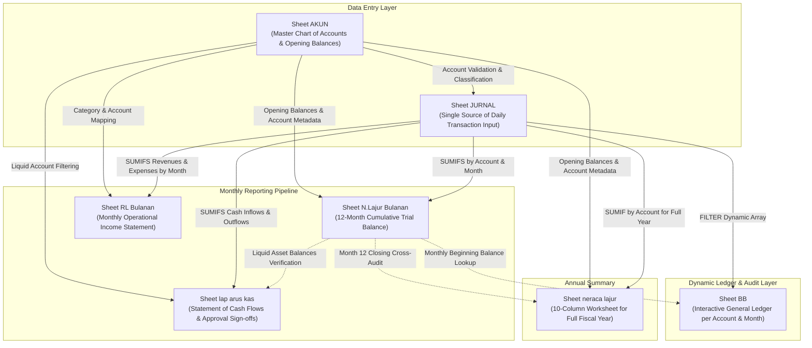
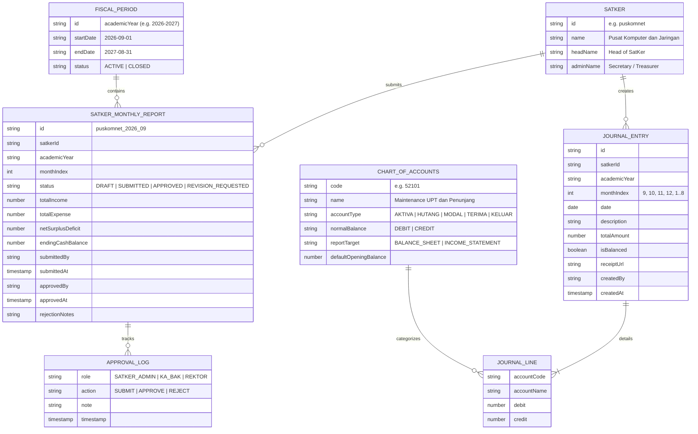
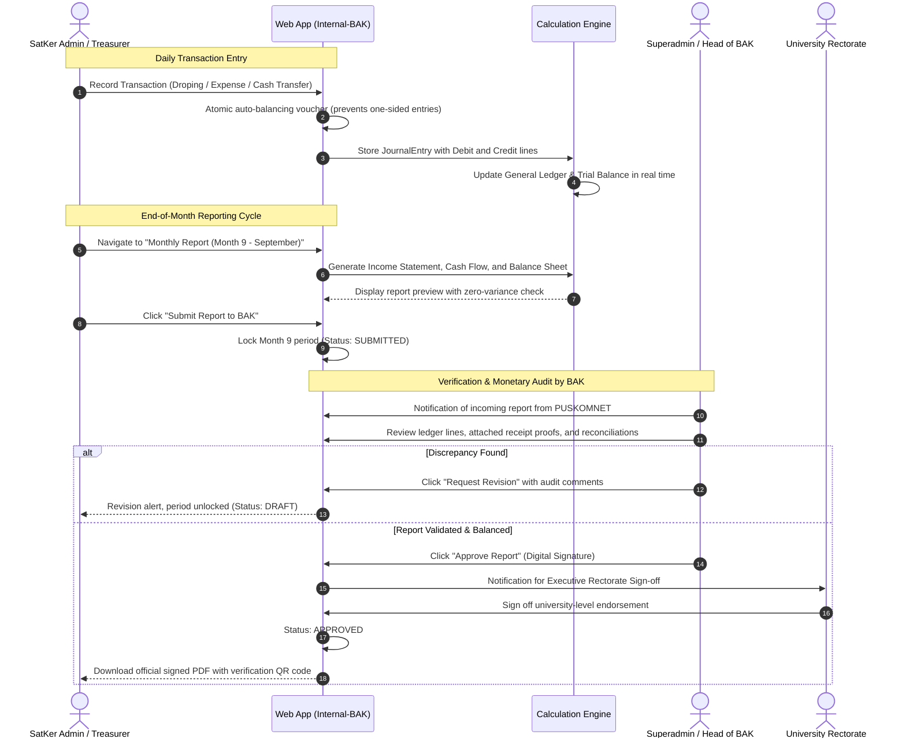

# Comprehensive Documentation: Work Unit (SatKer) Financial Reporting System
*Analysis and Specifications Derived from Excel Workbook: `5. PUSKOMNET 26 - 27.xlsx`*

---

## 1. Executive Summary & System Context

### 1.1 Background
Every month, the Heads of Loyalis Work Units (*Satuan Kerja* / SatKer) across **Universitas Pesantren Tinggi Darul Ulum (UNIPDU) Jombang** (e.g., PUSKOMNET, Academic Faculties, Technical Support Units / UPT, and Administrative Bureaus) are obligated to submit monthly financial accountability reports to the university's central monetary authority: the **Bureau of Financial Administration (Biro Administrasi Keuangan / BAK)**.

Historically, this reporting process has been conducted offline using local Microsoft Excel workbooks maintained on individual SatKer computers. At the close of each month, these spreadsheets are printed onto paper, manually signed, and physically delivered to the BAK office for manual auditing and verification.

### 1.2 Digitalization Objectives
The goal of this initiative is to incorporate the complete bookkeeping logic, Chart of Accounts (COA), double-entry balance validation, and automated financial statements (General Ledger, Trial Balance Worksheet, Monthly Operational Income Statement, and Statement of Cash Flows) directly into the web-based university management platform (**Internal-BAK**), achieving:
1. Complete elimination of local Excel files and physical paper submissions.
2. Prevention of data entry mistakes and unbalanced transactions (*human error*).
3. Real-time cash position and operational visibility for Superadmins / BAK across all SatKers.
4. Digitalization of the multi-tier sign-off and approval workflow: **SatKer Head / Secretary $\rightarrow$ Head of BAK $\rightarrow$ University Rectorate**.

---

## 2. Accounting Architecture & Fiscal Period

### 2.1 Academic Fiscal Year Calendar
Unlike a standard calendar fiscal year (January–December), the university's SatKer accounting system operates strictly on an **Academic Year** cycle:
* **Fiscal Period Start**: September 1 (Month Index 9 / Period 1)
* **Fiscal Period End**: August 31 (Month Index 8 / Period 12)
* **Monthly Reporting Sequence**:
  1. September (Month 9)
  2. October (Month 10)
  3. November (Month 11)
  4. December (Month 12)
  5. January (Month 1)
  6. February (Month 2)
  7. March (Month 3)
  8. April (Month 4)
  9. May (Month 5)
  10. June (Month 6)
  11. July (Month 7)
  12. August (Month 8)

### 2.2 Chart of Accounts (COA) Taxonomy
The Chart of Accounts utilizes a standardized 5-digit numbering system with standard accounting classifications:

| Account Group | Code Range | Account Type | Normal Balance | Statement Target | Description |
| :--- | :--- | :--- | :--- | :--- | :--- |
| **1xxxx** | 10000 – 13016 | **ASSETS (AKTIVA)** | `DEBIT` | `BALANCE SHEET` | Cash on hand, Bank accounts, Receivables, Fixed Assets, Accumulated Depreciation |
| **2xxxx** | 20000 – 20005 | **LIABILITIES (HUTANG)** | `CREDIT` | `BALANCE SHEET` | Short-term obligations and miscellaneous payables |
| **3xxxx** | 30000 | **EQUITY (MODAL)** | `CREDIT` | `BALANCE SHEET` | SatKer initial operating equity / capital |
| **4xxxx** | 40000 – 42010 | **REVENUES (TERIMA)** | `CREDIT` | `INCOME STATEMENT` | University dana droping allocations, training/service revenues |
| **5xxxx** | 50000 – 54102 | **EXPENSES (KELUAR)** | `DEBIT` | `INCOME STATEMENT` | Operational costs, honoraria/vakasi, campus & lab maintenance, refreshments, internet, bank charges |

---

## 3. Sheet Architecture & Formula Mechanics

The Excel workbook comprises **8 worksheets** organized around a **Single Source of Truth** data-entry paradigm:



---

### 3.1 Sheet `AKUN`: Master Chart of Accounts & Column Mapping
This sheet stores the master directory of 129 accounts alongside annual index lookup tables.

* **Primary Master Data Columns**:
  * `Column A (JENIS AKUN)`: Account Category (`AKTIVA`, `HUTANG`, `MODAL`, `TERIMA`, `KELUAR`).
  * `Column B (KODE AKUN)`: Unique 5-digit account number (e.g., `10000`, `11001`, `41000`, `52101`).
  * `Column C (NAMA AKUN)`: Official account title.
  * `Column D (POS SALDO)`: Normal balance orientation (`DEBET` or `KREDIT`).
  * `Column E (POS LAPORAN)`: Destination financial report (`NERACA` / Balance Sheet or `LABA RUGI` / Income Statement).
  * `Column F (SALDO AWAL DEBET)` & `Column G (SALDO AWAL KREDIT)`: Opening balance as of September 1.
* **Period Index Reference Table (Columns J–M)**:
  A dynamic lookup table that maps numerical months and calendar labels to corresponding column offsets in `N.Lajur Bulanan`:
  * Row 8: Month 1 (January 2027) $\rightarrow$ Column Index 13 (Debit) & 14 (Credit)
  * Row 16: Month 9 (September 2026) $\rightarrow$ Column Index 5 (Debit) & 6 (Credit)
  * Row 20: TAHUNAN (Annual) $\rightarrow$ Column Index 27 (Debit) & 28 (Credit)

---

### 3.2 Sheet `JURNAL`: General Journal (Daily Transaction Input)
The only worksheet intended for manual data entry. All other sheets derive their balances automatically from this journal.

#### Transaction Row Structure (Row 7 onwards)
| Column | Header | Data Type | Source / Formula | Description |
| :--- | :--- | :--- | :--- | :--- |
| **A** | `BLN` | Date / Text | Manual Input | Fiscal month label (e.g., `" Sep 2026"`) |
| **B** | `TGL` | Integer | Manual Input | Day of transaction (1 – 31) |
| **C** | `REF` | Numeric | Manual Input | Account code matching `AKUN` |
| **D** | `NAMA PERKIRAAN` | Formula | `=IFERROR(VLOOKUP(C7, AKUN!$B:$C, 2, FALSE), "")` | Auto-resolves account title |
| **E** | `URAIAN` | String | Manual Input | Memo / expense purpose / receipt notes |
| **F** | `DEBET` | Currency | Manual Input | Debit amount in IDR |
| **G** | `KREDIT` | Currency | Manual Input | Credit amount in IDR |
| **K** | `VALIDASI KODE` | Formula | `=COUNTIF(AKUN!$B:$B, C7)` | Ensures account code exists (1 = Valid, 0 = Invalid) |
| **M** | `BULAN NUMERIK` | Formula | `=IF(A7<>" ", MONTH(A7), "")` | Extracts month number (1–12) for `SUMIFS` queries |

#### Real-time Balance Validation Banner (Row 6)
The top banner executes instantaneous double-entry validation:
* **Total Debits (`F6`)**: `=ROUND(SUM(F7:F139710), -1)`
* **Total Credits (`G6`)**: `=ROUND(SUM(G7:G139710), -1)`
* **Imbalance Delta (`L6`)**: `=ROUND(F6 - G6, 0)`
* **Status Banner (`H6`)**:
  ```excel
  =IF(L6=0, "Alhamdulillah", "belum balance")
  ```

> [!WARNING] Real-World Finding from Sample File (Manual Input Hazard):
> In the source workbook `5. PUSKOMNET 26 - 27.xlsx`, Row 6 flags **`"belum balance"`** with a net difference of **Rp 7,074,450**.
> * **Root Cause**: The university budget droping (Rp 5,100,000) and ATM cash withdrawals were correctly entered as balanced double entries. However, operational expenses (lab maintenance, meeting refreshments) in rows 15–36 were debited with **no corresponding credit entry to Kas (`10000`)**.
> * **Digitalization Benefit**: The web application will enforce atomic double-entry via guided voucher forms (selecting expense category + payment source), making unbalanced entries physically impossible.

---

### 3.3 Sheet `neraca lajur`: Annual 10-Column Trial Balance Worksheet
Generates an accounting trial balance worksheet for the entire academic fiscal year dynamically.

#### 10-Column Structure & Mathematical Logic:
1. **Account Catalog (Cols A–D)**:
   Dynamically extracted from `AKUN`:
   `=FILTER(AKUN!B:E, AKUN!I:I="lajur")`
2. **Trial Balance / Neraca Saldo (Cols G & H)**:
   * **Debit Column (`G10`)**:
     ```excel
     =IF($C10="DEBET", VLOOKUP($A10, AKUN!$B:$G, 5, FALSE) + SUMIF(JURNAL!$C:$C, $A10, JURNAL!$F:$F) - SUMIF(JURNAL!$C:$C, $A10, JURNAL!$G:$G), 0)
     ```
   * **Credit Column (`H10`)**:
     ```excel
     =IF($C10="KREDIT", VLOOKUP($A10, AKUN!$B:$G, 6, FALSE) - SUMIF(JURNAL!$C:$C, $A10, JURNAL!$F:$F) + SUMIF(JURNAL!$C:$C, $A10, JURNAL!$G:$G), 0)
     ```
3. **Income Statement / Laba Rugi (Cols I & J)**:
   * Selects accounts where `Pos Laporan = "LABA RUGI"`:
     * Debit (`I`): Total Expenses
     * Credit (`J`): Total Revenues
4. **Balance Sheet / Neraca (Cols K & L)**:
   * Selects accounts where `Pos Laporan = "NERACA"`:
     * Debit (`K`): Assets
     * Credit (`L`): Liabilities & Equity
5. **Surplus / Deficit Allocation (Row 8)**:
   * Assessment: `=IF(J9 >= I9, "Surplus", "Defisit")`
   * The calculated surplus/deficit is automatically routed to balance both the Income Statement columns and the Balance Sheet equity section.

---

### 3.4 Sheet `N.Lajur Bulanan`: 12-Month Cumulative Trial Balance
Tracks cumulative monthly balances for every account from September 2026 through August 2027 (Columns E to AB).

* **Chained Progression Formula**:
  * **Month 1 (September 2026)**:
    $$\text{Debit Balance} = \text{Opening Balance (AKUN)} + \sum \text{Debit}_{\text{M9}} - \sum \text{Credit}_{\text{M9}}$$
  * **Month 2 (October 2026)**:
    $$\text{Debit Balance} = \text{Ending Balance September} + \sum \text{Debit}_{\text{M10}} - \sum \text{Credit}_{\text{M10}}$$
  * This cumulative chain continues through Month 12 (August 2027).
* **Integrity Audit Check (Cols AC & AD)**:
  Verifies that Month 12 cumulative balances match the annual trial balance in `neraca lajur`:
  * `AC10`: `=AA10 - 'neraca lajur'!K10`
  * `AD10`: `=AB10 - 'neraca lajur'!L10`
  *(Must evaluate to 0.00 across all accounts).*

---

### 3.5 Sheet `RL Bulanan`: Monthly Operational Income Statement
Provides month-by-month financial operational performance comparisons (Revenues vs Expenses) with an executive summary at the top.

#### Executive KPI Header Cards (Rows 8–11)
| Row | Metric Title | Month $m$ Formula | Description |
| :--- | :--- | :--- | :--- |
| **8** | **TOTAL REVENUES (JUMLAH PENERIMAAN)** | `=SUM(D13:D24)` | Total operational revenue recognized in the month |
| **9** | **TOTAL EXPENSES (JUMLAH PENGELUARAN)** | `=SUM(D26:D245)` | Total operational disbursements in the month |
| **10** | **NET SURPLUS / DEFICIT (SELISIH)** | `=D8 - D9` | Operational surplus (positive) or deficit (negative) |
| **11** | **CUMULATIVE CASH POSITION (SALDO KAS)** | `=PrevMonth_Cash + D10` | Real liquid cash & equivalent position |

#### Revenue & Expense Breakdown
* **Revenues (`TERIMA`, Rows 12–24)**:
  Pulls all accounts marked as `TERIMA` in `AKUN`. Formula per month:
  ```excel
  =SUMIFS(JURNAL!$G:$G, JURNAL!$C:$C, $A_row, JURNAL!$M:$M, Month) - SUMIFS(JURNAL!$F:$F, JURNAL!$C:$C, $A_row, JURNAL!$M:$M, Month)
  ```
* **Expenses (`KELUAR`, Rows 25–245)**:
  Pulls all accounts marked as `KELUAR` in `AKUN`. Formula per month:
  ```excel
  =SUMIFS(JURNAL!$F:$F, JURNAL!$C:$C, $A_row, JURNAL!$M:$M, Month) - SUMIFS(JURNAL!$G:$G, JURNAL!$C:$C, $A_row, JURNAL!$M:$M, Month)
  ```
* **Column P (Full Year Aggregate)**:
  `=SUM(D_row : O_row)` computes the year-to-date total for each line item.

---

### 3.6 Sheet `lap arus kas`: Statement of Cash Flows & Approval Sign-offs
The formal financial statement generated, printed, signed, and filed with BAK each month.

#### Interactive Period Filter
* Setting cell **`A3`** (e.g., `"01/09/2026"` or `"TAHUNAN"`) dynamically recalculates the cash flow statement for that target period.

#### 3 Standard Cash Flow Classifications:
1. **Section I: Operating Activities (Aktivitas Operasional)**:
   * Cash Inflows: University Droping (`41000`), miscellaneous revenues.
   * Cash Outflows: Honoraria/Vakasi, hardware maintenance, refreshments, ISP internet, bank admin fees.
   * Net Cash from Operating Activities (`F153`).
2. **Section II: Investing Activities (Aktivitas Investasi)**:
   * Capital expenditures for computer lab hardware and equipment (`F172`).
3. **Section III: Financing Activities (Aktivitas Pendanaan)**:
   * Loans, inter-unit funding, and capital changes (`F203`).

#### Cash Reconciliation & Integrity Check (Rows 205–215):
* `F205`: Net Change in Cash and Cash Equivalents (`=F153 + F172 + F203`)
* `F206`: Beginning Cash and Cash Equivalents
* `F207`: Ending Cash and Cash Equivalents (`=F205 + F206`)
* `F214`: Physical Cash & Bank Account Total (Cash `10000` + Bank Mandiri `11001` + other bank accounts)
* `F215`: Reconciliation Delta (`=F207 - F214`). **Must strictly equal 0.00**.

#### Governance Hierarchy & Signature Block (Rows 216–220 & 690)
1. **Report Preparer**: SatKer Secretary / Head of SatKer (Right column).
2. **Monetary Auditor**: Head of BAK (*Hj. Anna Qomariana, SE, M.PdI*) (Left column).
3. **Executive University Approval**: University Rector (*Dr. dr. H M. Zulfikar As'ad, MMR*).

---

### 3.7 Sheet `BB`: Interactive General Ledger
An audit drill-down tool allowing users to inspect transaction history for any specific account:
* User specifies target Account Code in cell `D2` (e.g., `52101`).
* User specifies target Period Date or `"TAHUNAN"` in cell `F1`.
* Filtered transaction history is extracted via:
  ```excel
  =IF(F1="TAHUNAN", FILTER(JURNAL!A:H, JURNAL!C:C=D2), FILTER(JURNAL!A:M, (JURNAL!C:C=D2)*(JURNAL!M:M=H1)))
  ```
* Automated validation confirms the ending balance matches `N.Lajur Bulanan` (Cells `I8` and `J8` render `"Alhamdulillah"`).

---

## 4. Web Application Digitalization Blueprint (Internal-BAK)

### 4.1 Data Model (Proposed Firestore Collections)



---

### 4.2 End-to-End User Journey



---

### 4.3 Form UX Recommendations to Eliminate Human Error
To prevent the manual balancing errors observed in the Excel file, the application should provide guided input workflows:

1. **Simple Expense Voucher**:
   * The user selects:
     * Expense Account (`REF`): e.g., *Maintenance UPT (52101)*
     * Payment Source: Dropdown [ *Cash on Hand (10000)* | *Bank Mandiri (11001)* ]
     * Amount: *Rp 655,000*
     * Description & Photo Receipt: *Mobo H61 Core i3*
   * **The system automatically generates balanced double-entry lines**:
     * Debit 52101 (Maintenance UPT): Rp 655,000
     * Credit 10000 (Cash on Hand): Rp 655,000
2. **Inflow / Droping Voucher**:
   * Selection of Droping from BAK automatically generates:
     * Debit 11001 (Bank Mandiri) / 10000 (Cash): Rp 5,000,000
     * Credit 41000 (University Droping): Rp 5,000,000
3. **Advanced Multi-Line Double-Entry Mode**:
   * Available for complex composite transactions, with the "Submit" action strictly disabled until `Total Debits === Total Credits`.

---

### 4.4 Comparative Analysis: Excel Workbooks vs. Web Application
| Capability | Current Excel Paper Process | Digital Web Application (Internal-BAK) |
| :--- | :--- | :--- |
| **Data Storage** | Isolated on local computers; vulnerable to loss | Centralized Firestore cloud storage with automated backups |
| **Balance Integrity** | Prone to human error (entries can remain unbalanced) | Enforced zero-difference validation on submission |
| **Filing & Submission** | Printed on paper and hand-delivered physically | 1-click digital submission from the SatKer dashboard |
| **BAK Monitoring** | Must wait for month-end paper deliveries | Real-time monitoring of all SatKer cash positions and ledgers |
| **University Consolidation**| Manual, error-prone copying across multiple Excel files | Instant university-wide consolidated financial reporting |
| **Audit Trail** | None (modifications cannot be tracked) | Comprehensive change logs, timestamps, and revision histories |

---
*This document serves as the official technical and functional specification for implementing the SatKer Financial Reporting Module in the Internal-BAK application.*
